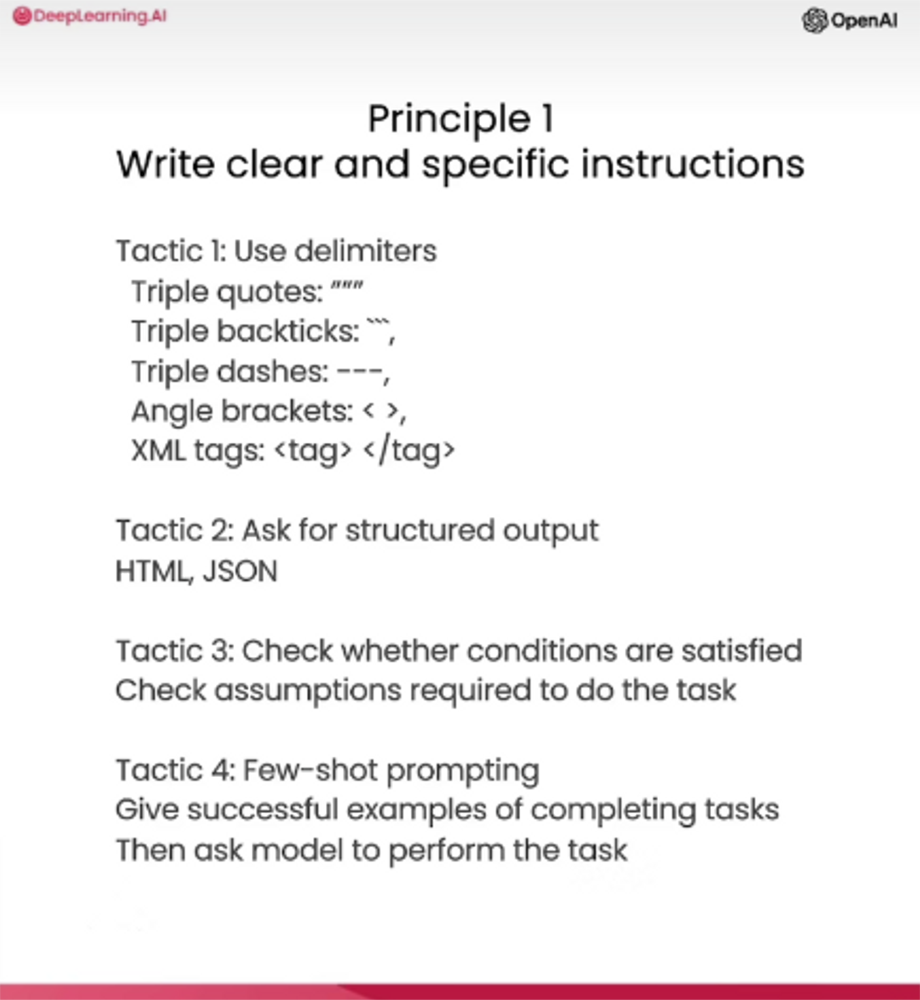
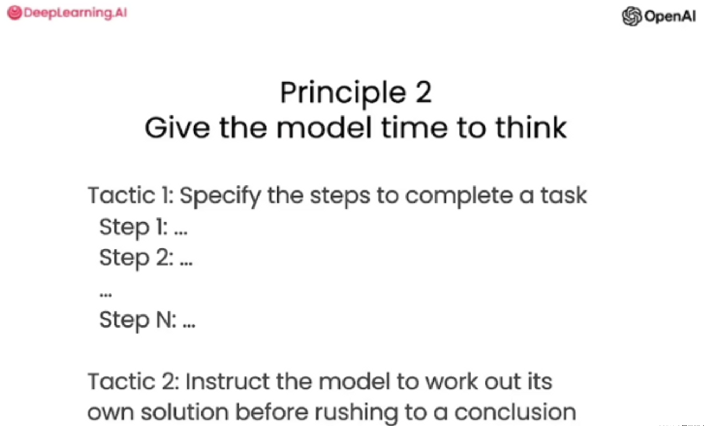
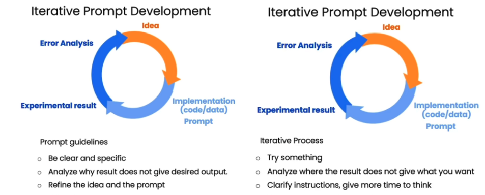
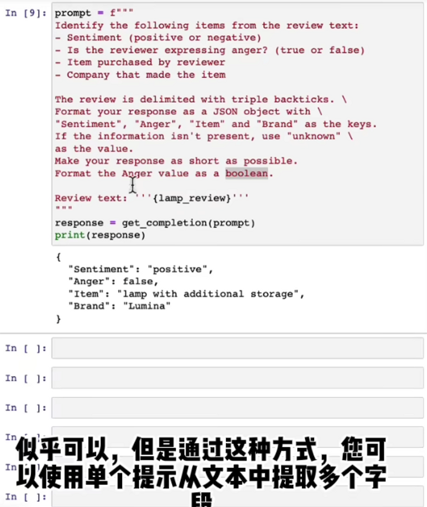
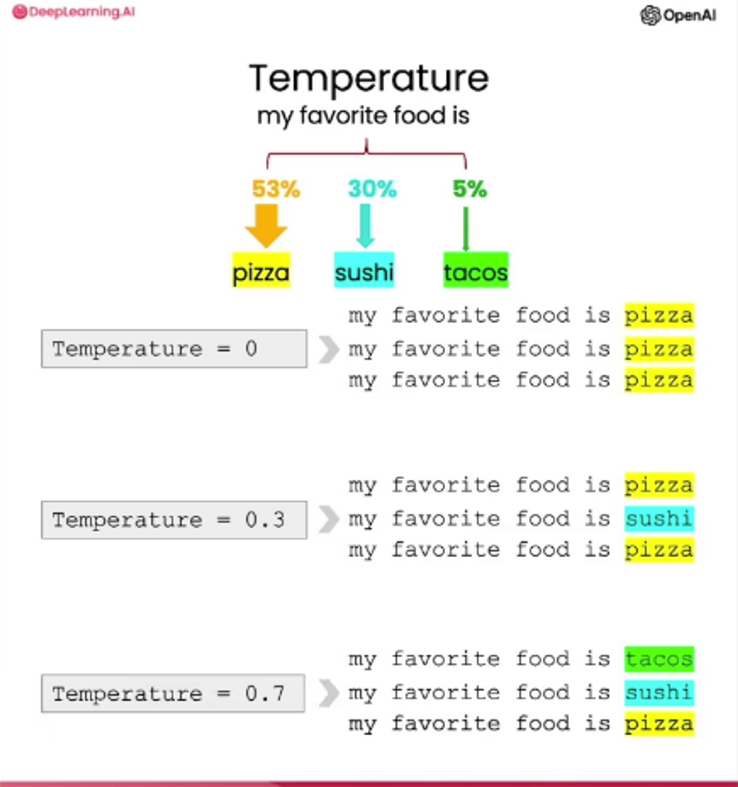
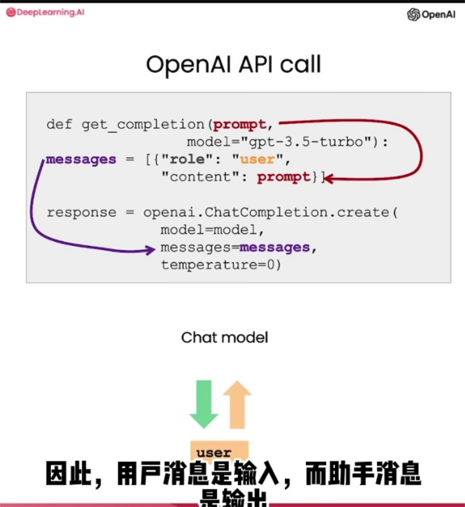
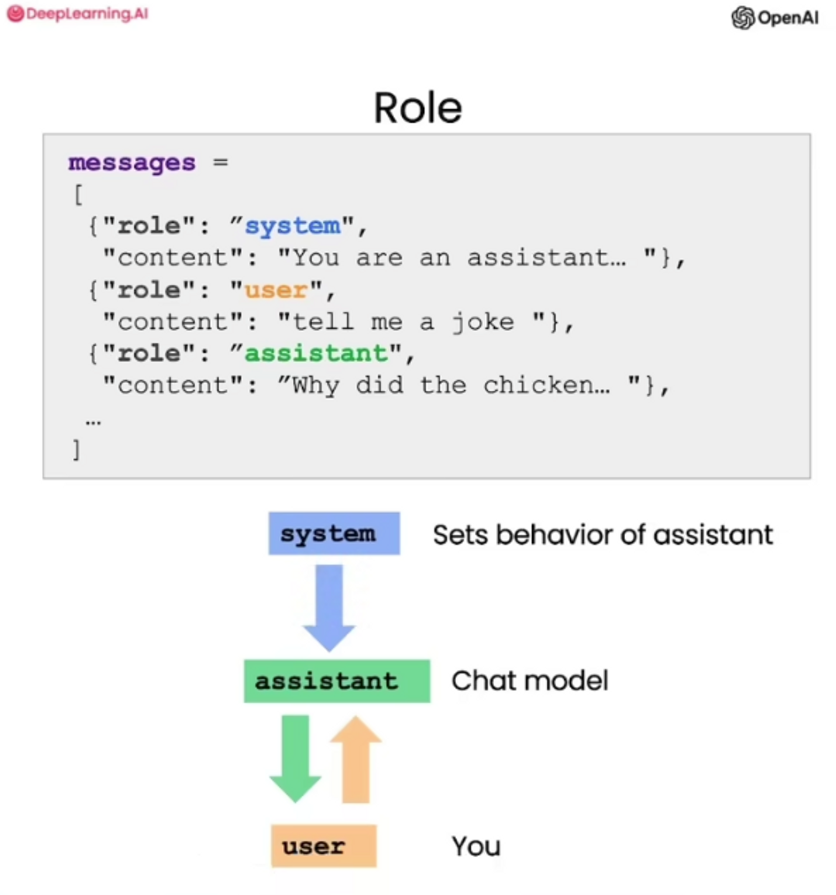

# prompt
## Guidelines for Prompting
### 编写明确和具体的指令
1.使用分隔符清楚地指示输入的不同部分，分隔符可以是任何清晰的标点符号。  
2.要求结构化输出内容。  
3.要求模型检查是否满足条件。如果任务存在假设未必满足，那么可以告诉模型首先检查这些假设，如果不满足，则指示并停止尝试完全完成任务。  
4.“少量训练提示”：要求模型执行任务之前，提供成功执行任务的示例。  

### 给模型足够的时间来思考
1.指定完成任务所需的步骤（给好回答步骤）  
2.指示模型在匆忙做出结论之前思考解决方案（即在让模型说出答案是否正确之前，为模型提供足够时间去实际思考问题）  

##  lterative Prompt Development
正如机器学习算法训练一样，一次训练就能正常工作的可能性很低，Prompt Development 也是一样，也许可能性会大一点。因此需要不断迭代训练。

##  Summarizing
概述总结的应用非常多，除了常用的文献凝练，还可以用于读取评论区并分别总结每一条内容。
我的理解：大量输入评论内容，让 GPT 自动总结并排版列表（仪表盘），分析每一条评论是否正面、核心问题、建议等等，有需要详细信息再返回原评论。
##  Inferring
把目标想象成模型以文本作为输入并执行某种分析的任务。

##  Transforming
大语言模型非常擅长将其输入转换为不同的格式，例如翻译、拼写和语法纠正。相对以往，这些都是通过一堆正则表达式实现的，实现难度较大。
##  Expanding
语言模型的输入参数：温度，模型响应中变化探索的程度和多样性。  
教程的任务：自动回复邮件，回复消费者邮件，根据情感是否积极来对应回复。  

## Building a Chatbot
系统消息有助于设置助手的行为和人设，并作为高层指令用于对话，可以将它视为在助手的耳边低语，引导它的回应，而用户不会意识到系统消息的存在。为开发者提供了一种在不将请求本身作为对话一部分的情况下引导助手并指导其回复的方式。

